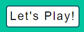

# Rock, Paper, Scissors, Lizard, Spock

[View the live project here](https://rob-mundy.github.io/Rock-paper-scissors-lizard-spock/index.html)

The Rock, Paper, Scissors, Lizard, Spock website is dedicated to the game of the same name featured on The Big Bang Theory that is an extension of the original game of "Rock, Paper, Scissors".

Website users can engage in a "first to five" game of chance against the computer.

+ ## Rules

As Sheldon explains in the Big Bang Theory, "Scissors cuts paper, paper covers rock, rock crushes lizard, lizard poisons Spock, Spock smashes scissors, scissors decapitate lizard, lizard eats paper, paper disproves Spock, Spock vaporizes rock, and as it always has, rock crushes scissors."

# Features

+ ## Navigation

     

    + The navigation section is positioned at the top of the webpage in a consistent location.

    + It contains the website's name "Rock, Paper, Scissors, Lizard, Spock" in the centre, which links to the top of the home page.

    + A hyperlink to an external site containing a brief history of the game as well as the rules can be found underneath the site name, "Rules (new tab)".   

    + A media query reorganises the header on smaller screens.
     
+ ## The game zone

     

    + The main game zone contains three distinct sections: a user-selection zone containing clickable buttons representing the 5 available hand shapes, a battle area displaying the user and computer hand shape choices, and a "Let's Play!" button that initiates the game. 

    + The area is simple in its design, uncluttered and intuitive to use. 

+ ## The user selection zone

     

    + This area contains 5 buttons representing the 5 available hand shapes for the user to select.   

    + The buttons are organised in the same order as the game's name: Rock, Paper, Scissors, Lizard, Spock.

    + The buttons change color to orange when the cursor hovers over them, and the aria-labels detailing the button names are displayed within the button borders giving visual cues to the user.

         

    + The button borders become dotted briefly when the user makes their selection upon clicking.  

+ ## The battle area

     

    + This section displays the user and randomly-generated computer hand shapes that are to be pitted against each other.

    +  Both will be represented by a "?" until the user makes a selection by clicking a hand shape button.

    + The computer's selection only updates after the winner is declared. 

+ ## The Let's Play! button

    

    + When the user has chosen their hand shape they can invoke the functions that generate the computer's choice and determine the game's outcome (win, loss, draw) by clicking the "Let's Play!" button.

    + The button colors change on hover as a visual cue to the user:  
  
        

    + If clicked before a shape is chosen an alert will be displayed to the user asking them to choose a shape:  

         

    + When the game has finished the result of the round is declared via an alert to the user (win, lose, draw) stating which shape was victorious:

          
        
    + The button is replaced at the end of each round with a "Play Again?" button that resets the battle area when clicked.  
        
          
           
    + The user can also reset the battle area and Let's Play!/Play Again? button by selecting a new shape at the end of the round.

+ ## The Score tally section

       
    
    + The score tally section increments user wins, losses and draws at the end of each round.

    + The scores are reset when the wins or losses are equal to five.

    + An alert is presented to the user when 5 wins or losses have been reached.

           
        
# UX Design

+ ## Color Palette

    + A suitable color palette was generated via [mycolor.space](https://mycolor.space/) AI tool.

    + The highlights are complimentary to the core colors.

+ ## Fonts

    + The font used throughout the site, Roboto, has been chosen for its simple, contemporary style and readability.

+ ## Media Queries

    + The website was designed with a desktop-first approach. 

    + Media queries have been employed to re-organise the site's dividing sections on smaller screens such as tablets and mobiles, aligning and centring the content vertically to improve aesthetics and readability.

# Testing

+ I have tested that the entire site works as expected across several commonly used browsers: Chrome (desktop), Edge, Firefox, and Chrome (Android).  I do not have access to an Apple device to check the site's compatibility with the Safari browser.

+ The user selection button aria labels that display on hover could be aligned more effectively as they are slightly obscured when viewed in firefox:

    

+ The website has been tested in Chrome's DevTools. I can confirm it is responsive, performs well, and functions on standard screen sizes down to the "Mobile S - 320px" setting.

+ The navigation section, header, headings, and subheadings are all easily legible and easy to understand.

+ I have tested the [README.md](https://rob-mundy.github.io/Rock-paper-scissors-lizard-spock/README.md) file with the [MD Reader](https://chrome.google.com/webstore/detail/md-reader/medapdbncneneejhbgcjceippjlfkmkg) extension for Chrome.

# Bugs

+ An error in the JavaScript determineWinner function was found that was producing incorrect results when the user's hand shape was pitted against the second computer shape that it should have been victorious over (the OR || in the statement). 

+ This was rectified by splitting the statement into two and including additional parentheses.     

+ While the function works as expected, the code is quite long so there must be a more elegant way to determine the game's winner.  

+ There are no outstanding bugs.

# Validator Testing

+ ## HTML

    + All pages passed through the official W3C Validator without errors.

+ ## CSS

    + All pages passed through the official W3C Jigsaw Validator without errors.

+ ## JavaScript

    + The site passed through the [JSHint](https://jshint.com/) validator with 29 warnings.

    + All bar 2 of the warnings relate to the compatibility of the syntax used across certain browsers, with advice on which browser versions to use.  I have chosen to ignore these as the syntax used is as taught in the syllabus.

    + The remaining 2 errors stated that the "Functions declared within loops referencing an outer scoped variable may lead to confusing semantics". I have chosen to ignore these as the same warnings appear when the walkthrough project "Love Maths" script is entered into the validator. 

+ ## Accessibility 

    + All pages achieved the maximum Dev Tools Lighthouse accessibility score of 100 on desktop and mobile, demonstrating that the chosen colours and fonts are easily legible.
    
        Desktop (home page):

        

        Mobile (home page):  
    
               

# Deployment

## Github Pages

The site was deployed to Github Pages via the following process:

+ Navigate to settings from within the Rock-paper-scissors-lizard-spock Github project

+ Select Pages from the Code and automation section

+ Under Build and deployment, select the source as "Deploy from a branch", then select "main" and "/(root)" from the Branch drop-down menus

+ A link to the live site is then made available upon page refresh

# Credits

## Content

+ All font icons are from [fontawesome.com](https://fontawesome.com/).

+ The idea for displaying the user selection buttons' aria labels on hover was sourced from [russmaxdesign.github.io](https://russmaxdesign.github.io/aria-label-popover/)