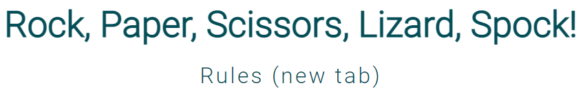

# Rock, Paper, Scissors, Lizard, Spock

[View the live project here](https://rob-mundy.github.io/Rock-paper-scissors-lizard-spock/index.html)

The Rock, Paper, Scissors, Lizard, Spock website is dedicated to the game of chance of the same name featured on The Big Bang Theory that is an extension of the original game of "Rock, Paper, Scissors".

Website users can engage in a "first to five" game of chance against the computer.

# Features

+ ## Navigation

    

    + The navigation section is positioned at the top of each webpage in a consistent location.

    + It contains the group's name "Rock, Paper, Scissors, Lizard, Spock" in the centre, which links to the top of the home page.

    + A hyperlink to an external site containing a brief history of the game as well as the rules can be found underneath the site name, "Rules (new tab)".   

    + A media query ...........:
     
+ ## The game zone

    

    + The main game zone contains three distinct sections: a user-selection zone containing clickable buttons representing the 5 available hand shapes, a battle area displaying the user and computer hand shape choices, and a "Let's Play!" button that initiates the game. 

    + The area is simple in its design, uncluttered and intuitive to use. 

+ ## The user selection zone

    

    + 

    + 

+ ## The Battle area

    

    + 

    +  

+ ## The Score tally section

    

    + 

    + 

+ ## The Footer
  
    + 

# UX Design

+ ## Color Palette

    + A suitable color palette was generated via colormind.io's AI tool, chosen for its calming, natural tones:

        

+ ## Fonts

    + The font used for the company name and subsequent h1 and h2 headings, Roboto, has been chosen for its simple, contemporary style and readability.

    + 

+ ## Media Queries

    + The website was designed with a desktop-first approach. 

    + Media queries have been employed to re-organise the site's dividing sections on smaller screens such as tablets and mobiles, aligning and centring the content vertically to improve aesthetics and readability.

# Testing

+ I have tested that the entire site works as expected across several commonly used browsers: Chrome (desktop), Edge, Firefox, and Chrome (Android).  I do not have access to an Apple device to check the site's compatibility with the Safari browser.

+ The user selection button aria labels that display on hover could be aligned more effectively as they are slightly obscured when viewed in firefox:

    

+ The website has been tested in Chrome's DevTools. I can confirm it is responsive, performs well, and functions on standard screen sizes down to the "Mobile S - 320px" setting.

+ The navigation section, header, headings, and subheadings are all easily legible and easy to understand.

+ I have tested the [README.md](https://rob-mundy.github.io/Rock-paper-scissors-lizard-spock/README.md) file with the [MD Reader](https://chrome.google.com/webstore/detail/md-reader/medapdbncneneejhbgcjceippjlfkmkg) extension for Chrome.

# Bugs

+ 

+ There are no outstanding bugs.

# Validator Testing

+ ## HTML

    + All pages passed through the official W3C Validator without errors.

+ ## CSS

    + All pages passed through the official W3C Jigsaw Validator without errors.

+ ## JavaScript

    + The site passed through the [JSHint](https://jshint.com/) validator with 29 warnings.

    + All bar 2 of the warnings regard the compatibility of the syntax used across certain browsers, with advice on which browser versions to use.  I have chosen to ignore these as the syntax used is as taught in the syllabus.

    + The remaining 2 errors stated that the "Functions declared within loops referencing an outer scoped variable may lead to confusing semantics". I have chosen to ignore these as the same warnings appear when the walkthrough project "Love Maths" script is entered into the validator. 

+ ## Accessibility 

    + All pages achieved the maximum Dev Tools Lighthouse accessibility score of 100 on desktop and mobile, demonstrating that the chosen colours and fonts are easily legible.
    
        Desktop (home page):

        

        Mobile (home page):  
    
        

        Rules page:

        

# Deployment

## Github Pages

The site was deployed to Github Pages via the following process:

+ Navigate to settings from within Whippet Walks Github project

+ Select Pages from the Code and automation section

+ Under Build and deployment, select the source as "Deploy from a branch", then select "main" and "/(root)" from the Branch drop-down menus

+ A link to the live site is then made available upon page refresh

# Credits

## Content

+ All font icons are from [fontawesome.com](https://fontawesome.com/).

+ The idea for displaying the user selection buttons' aria labels on hover was sourced from [russmaxdesign.github.io](https://russmaxdesign.github.io/aria-label-popover/)

## Media

+ 